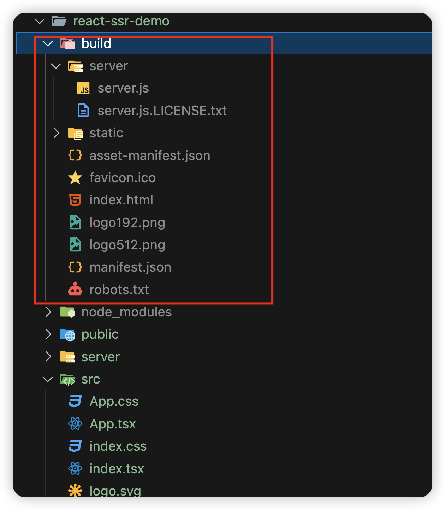
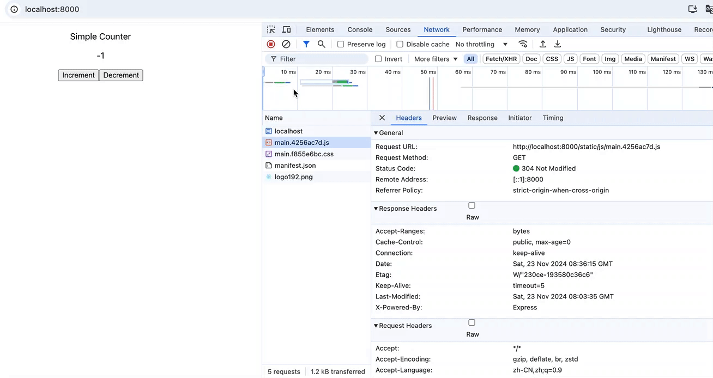

# React SSR 入门

## 目录

- [新手步骤](#新手步骤)
  - [创建一个react应用](#创建一个react应用)
  - [简单修改默认页面的内容](#简单修改默认页面的内容)
  - [添加一个服务器](#添加一个服务器)
- [最终构建产物](#最终构建产物)
- [启动node服务，访问ssr](#启动node服务访问ssr)
- [参考资料](#参考资料)

# 新手步骤

## 创建一个react应用

```bash
// 创建一个名称为 react-ssr-demo 的 react 应用
pnpm create react-app react-ssr-demo --template typescript
```

## 简单修改默认页面的内容

- 一个简单的计数器页面。
  ```typescript
  import React from 'react';
  import './App.css';

  function App() {
    const [count, setCount] = React.useState(0);

    const increment = () => {
      setCount(count + 1);
    }

    const decrement = () => {
      setCount(count - 1);
    }


    return (
      <div className="App">
        <p>Simple Counter</p>
        <p>{count}</p>
        <button onClick={increment}>Increment</button>
        <button onClick={decrement}>Decrement</button>
      </div>
    );
  }

  export default App;
   src/App.tsx
  ```
- react应用“注水”
  ```typescript
  import React from 'react';
  import ReactDOM from 'react-dom/client';
  import './index.css';
  import App from './App';
  import reportWebVitals from './reportWebVitals';

  // const root = ReactDOM.createRoot(
  //   document.getElementById('root') as HTMLElement
  // );
  // root.render(
  //   <React.StrictMode>
  //     <App />
  //   </React.StrictMode>
  // );

  // 使用hydrateRoot方法来渲染ssr返回的html
  ReactDOM.hydrateRoot(document.getElementById('root')  as HTMLElement, <App />)

  // If you want to start measuring performance in your app, pass a function
  // to log results (for example: reportWebVitals(console.log))
  // or send to an analytics endpoint. Learn more: https://bit.ly/CRA-vitals
  reportWebVitals();
   src/index.tsx
  ```
- 打包react应用，生成构建产物，供ssr服务使用
  ```bash
  pnpm run build
  ```

## 添加一个服务器

- 添加一个文件夹server，编写server.js&#x20;
  ```typescript
  import express from "express";
  import fs from "fs";
  import path from "path";

  import React from "react";
  import ReactDOMServer from "react-dom/server";

  import App from "../src/App";

  const PORT = 8000;
  const app = express();

  app.use("^/$", (req, res, next) => {
    fs.readFile(path.resolve("./build/index.html"), "utf-8", (err, data) => {
      if (err) {
        console.log(err);
        return res.status(500).send("Some error happened");
      }
      return res.send(
        data.replace(
          '<div id="root"></div>',
          `<div id="root">${ReactDOMServer.renderToString(<App />)}</div>`,
        ),
      );
    });
  });

  console.log(path.resolve(__dirname, "../..", "build"));

  app.use(express.static(path.resolve(__dirname, "../..", "build")));

  app.listen(PORT, () => {
    console.log(`App launched on ${PORT}`);
  });
   src/server/server.js
  ```
- 初始化和安装依赖，以express为例&#x20;
  ```bash
  cd server
  # 初始化server
  pnpm init

  # 安装express服务
  pnmp add express

  # 安装webpack等用于打包服务文件，转成可以执行的js
  pnpm add webpack webpack-cli babel-loader css-loader @babel/preset-env @babel/preset-react @babel/preset-typescript --save-dev


  ```
- 编写webpack打包文件
  ```javascript
  const path = require('path');
  // const nodeExternals = require('webpack-node-externals');

  /**
   * @type {import('webpack').Configuration}
   */
  module.exports = {
    target: 'node',
    entry: './server.js',
    output: {
      path: path.resolve(__dirname, '..', 'build/server'),
      filename: 'server.js',
    },
    // 解析配置
    resolve: {
      // 添加 `.ts` 和 `.tsx` 为可解析扩展名
      extensions: ['.tsx', '.ts', '.js'],
    },
    // externals: [nodeExternals],
    module: {
      rules: [
        {
          test: /\.(tsx?|jsx?|mjs)$/i,
          exclude: /node_modules/,
          use: "babel-loader",
          // use: {
          //   loader: 'babel-loader',
          //   options: {
          //     presets: ['@babel/preset-env', '@babel/preset-react', '@babel/preset-typescript']
          //   }
          // }
        },
        {
          test: /\.css$/i,
          use: [
            'css-loader',
          ],
        },
      ]
    }
  }
   server/webpack.server.config.js
  ```
  ```json
  {
    "presets": [
      [
        "@babel/preset-env",
        {
          "useBuiltIns": "entry",
          "corejs": "3.22"
        }
      ],
      "@babel/preset-react",
      "@babel/preset-typescript"
    ]
  } server/babel.config.json
  ```
- 打包脚本
  ```json
  "scripts": {
      "build": "webpack --config webpack.server.config.js"
    } server/package.json
  ```
- 执行构建脚本，生成server可运行的nodejs文件
  ```markdown
  # 注意：实在server目录下，执行脚本
  pnpm run build

  ```

# 最终构建产物



# 启动node服务，访问ssr

- 在项目根目录下，即 `react-ssr-demo/package.json` 中，添加启动脚本
  ```json
  "scripts": {
    // ...
    "ssr": "node ./build/server/server.js"
  }, react-ssr-demo/package.json
  ```
- 浏览器访问express服务，查看效果

  

# 参考资料

- [React Server Side Rendering Introduction For Beginners - ReactJS ssr with Expressjs](https://www.youtube.com/watch?v=NwyQONeqRXA "React Server Side Rendering Introduction For Beginners - ReactJS ssr with Expressjs")
